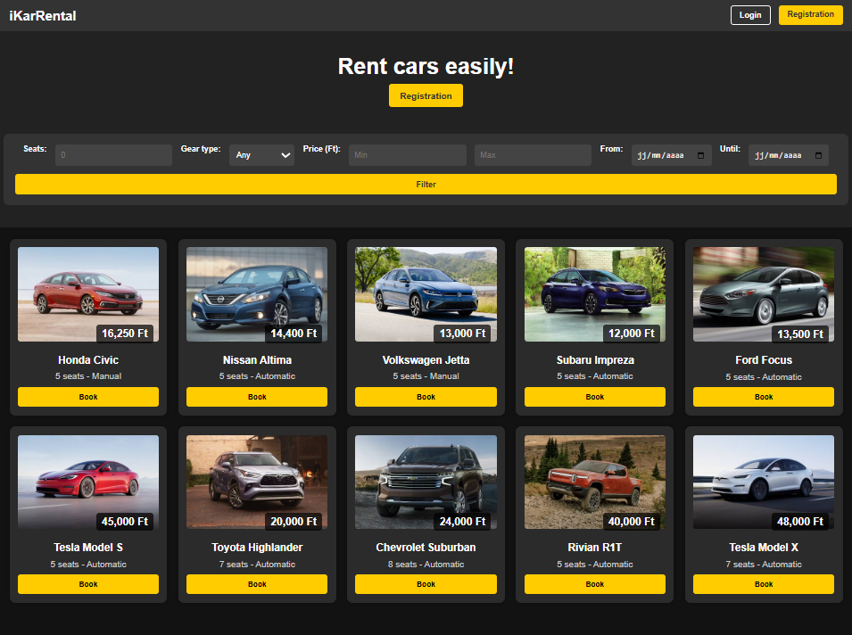
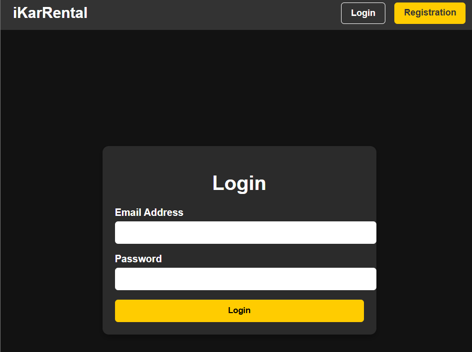
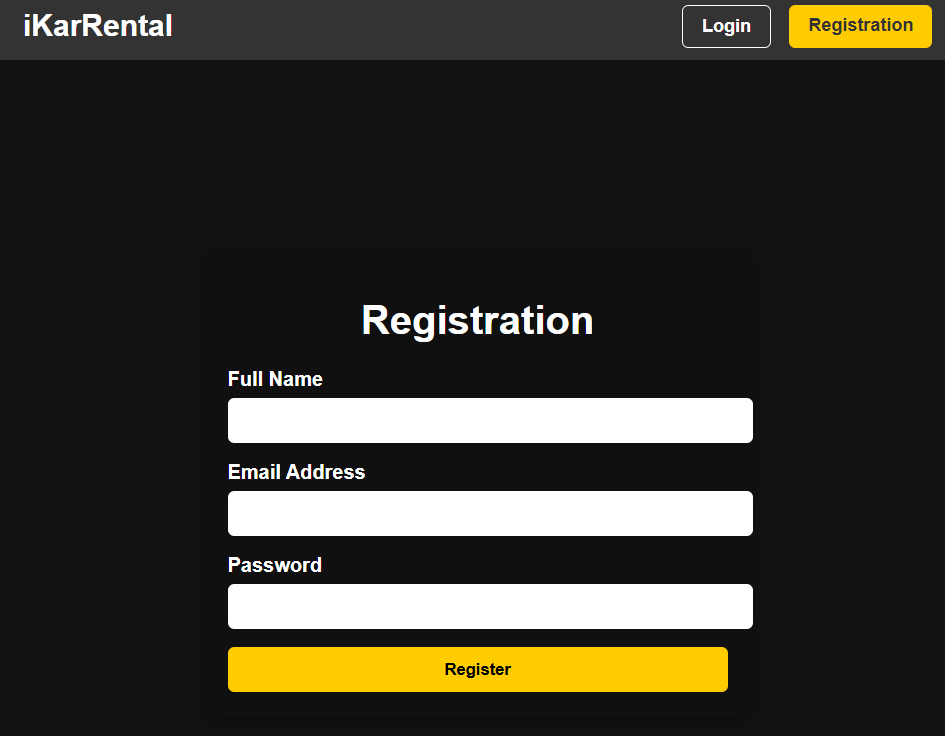
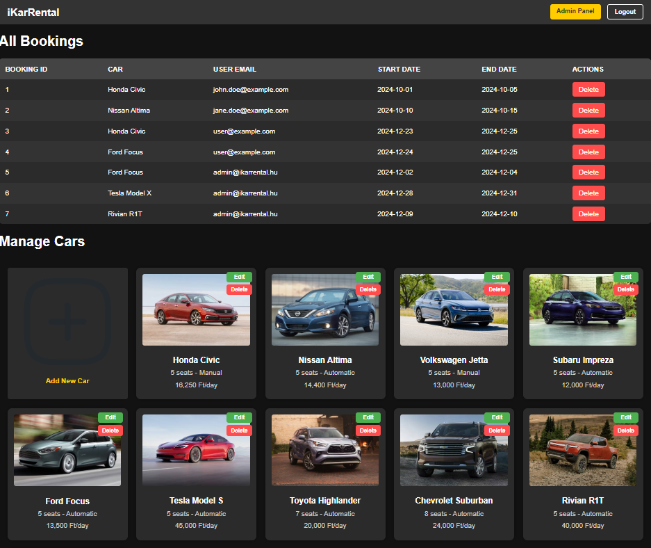
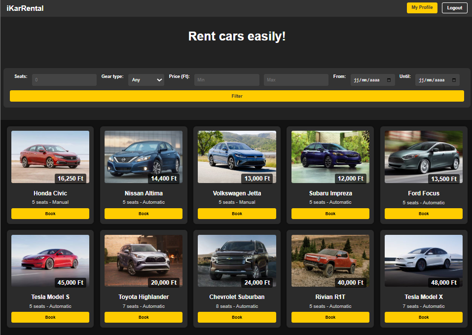
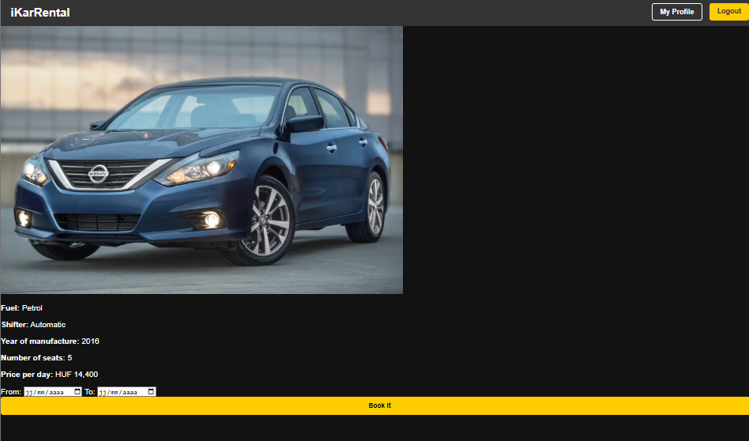
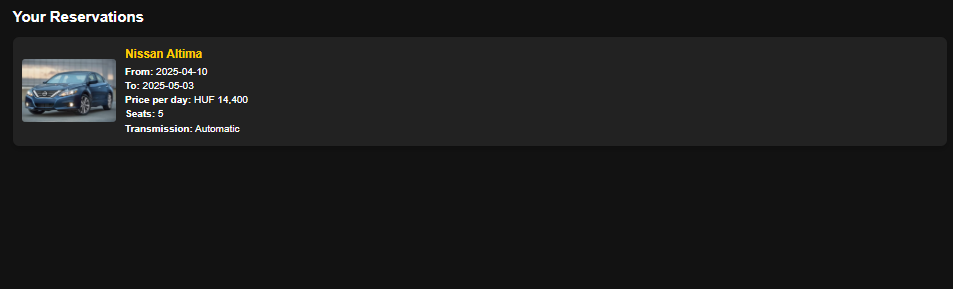

# 🚗 Car Rental Web Application

A car rental system built with **PHP**, featuring user authentication,
car management, booking functionality, and dynamic filtering — all presented in a web-friendly design.

---

## 🚀 Features

### ✅ Minimum Requirements
- Homepage lists all cars and their basic attributes
- Click on a car’s name or card to view detailed car information
- Car Details Page shows full attributes and images
- Admin can create new cars with proper validation

### ✅ Core Features
- User Registration with validation
- User Login and session handling
- Dynamic homepage filtering (including date range availability)
- Car booking for specific dates with booking confirmation
- Profile page showing user's past bookings
- Admin profile showing all bookings with deletion option
- Admin can modify and delete car entries
- Responsive and polished web-friendly design

---

## 🏗️ Technologies Used

- PHP
- HTML
-  CSS

---

## 🎨 Screenshots

### 🏴 Landing Page

### 🌫️ Login Page

### 🌫️ Registration Page

### 👨🏻‍💼 Admin Page

### 👨🏻‍💻 User page

### 🗓️ Booking page 

### 📌 Reservation page 

